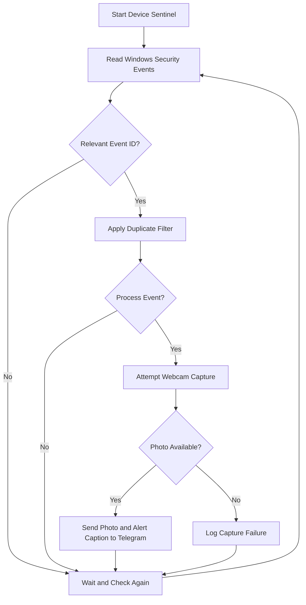

# 🛡️ Device Sentinel
### Windows Login Monitoring & Telegram Security Alert System

**Device Sentinel** is a personal cybersecurity project designed to monitor login activity on a Windows computer, capture a webcam photo when a relevant login event is detected, and send a security alert with the photo and event details to Telegram.

The goal is to help a device owner become aware of login activity when they are away from their computer.

> **Project status:** Working prototype. Windows Security event monitoring, webcam capture, and Telegram photo alerts have been tested on the developer's Windows computer.

---

## 📑 Table of Contents

- [Overview](#-overview)
- [Problem Statement](#-problem-statement)
- [Project Objectives](#-project-objectives)
- [Key Features](#-key-features)
- [How It Works](#-how-it-works)
- [System Architecture](#-system-architecture)
- [Technologies Used](#-technologies-used)
- [Project Structure](#-project-structure)
- [System Requirements](#-system-requirements)
- [Installation and Setup](#-installation-and-setup)
- [Configuration](#-configuration)
- [Running the Application](#-running-the-application)
- [Automatic Startup](#-automatic-startup)
- [Testing](#-testing)
- [Security and Privacy](#-security-and-privacy)
- [Current Limitations](#-current-limitations)
- [Future Enhancements](#-future-enhancements)
- [Learning Outcomes](#-learning-outcomes)
- [Contributing](#-contributing)
- [License](#-license)

---

## 🔍 Overview

Device Sentinel is a Windows-based login monitoring prototype built with Python.

It uses the Windows Security event log to detect selected login-related events. When a matching event is detected, the program attempts to capture an image using the computer's connected webcam. If photo capture succeeds, the image and relevant event information are sent to a configured Telegram chat.

The project combines Windows event monitoring, camera access, event filtering, environment-based configuration, and remote notifications in one application.

### Why Device Sentinel?

A computer owner may want to know when someone attempts to access their device while they are away. Device Sentinel explores one way to provide remote awareness through automated login-event alerts.

The project is being developed incrementally, beginning with a Windows agent and with the longer-term goal of exploring a companion Android application.

---

## 🎯 Problem Statement

A device owner may not immediately know that a login attempt or login event occurred while they were away from their computer.

Built-in operating system logs can record security events, but checking them manually requires access to the computer and knowledge of Windows event logs.

Device Sentinel aims to make selected login events easier to notice by sending a Telegram notification containing event details and, when available, a webcam image.

## 🎯 Project Objectives

- Monitor selected Windows Security login events.
- Distinguish successful login events from failed login attempts.
- Attempt webcam photo capture when a matching event is detected.
- Send a remote Telegram alert containing the image and event details.
- Reduce repeated alerts caused by closely spaced duplicate events.
- Support launching the monitoring agent through Windows Task Scheduler.
- Keep credentials and captured images out of the public Git repository.
- Establish a foundation for future cross-device security features.

---

## ✨ Key Features

### 🔐 1. Windows Security Event Monitoring

The application reads events from the Windows Security event log and checks for selected event IDs.

| Event ID | Meaning | Device Sentinel behavior |
|---|---|---|
| `4624` | Successful logon | Recognizes the event and attempts photo capture |
| `4625` | Failed logon | Recognizes the event and attempts photo capture |

**Important:** Windows Event ID `4624` can represent different kinds of logons, not just someone unlocking the physical computer. Event ID `4625` records failed logon attempts. Further filtering is planned to distinguish relevant interactive logons from other event types.

### 📸 2. Webcam Photo Capture

The camera module uses OpenCV to access the default camera.

When a matching event is processed, the application attempts to:

1. Open the webcam.
2. Read a frame from the camera.
3. Create a local `photos/` directory if necessary.
4. Save the image with a timestamped filename.
5. Return the saved image path to the monitoring module.

If the webcam is unavailable, disabled, covered by privacy controls, or being used by another application, photo capture may fail.

### 📲 3. Telegram Security Alerts

The notification module communicates with the Telegram Bot API.

When photo capture succeeds, Device Sentinel sends a photo to the configured Telegram chat with a caption containing details such as:

- Alert heading
- Detected event type
- Windows event ID
- Event timestamp

The current prototype sends the alert text as the photo caption instead of sending a separate text-only message.

### ⏱️ 4. Basic Duplicate-Alert Filtering

Windows can generate multiple related events close together.

The current implementation includes a time-based filter intended to reduce repeated alerts within a 30-second interval.

This is a basic prototype safeguard, not a complete event-deduplication system. More reliable filtering based on event record IDs, logon types, and event-specific logic is planned.

### 🚀 5. Windows Task Scheduler Integration

The application can be configured to start at Windows sign-in using Task Scheduler.

Because access to the Security event log requires sufficient permissions, the task must be configured to run with the necessary privileges.

Automatic startup should be tested after configuration and after future application changes.

---

## 🔄 How It Works

The current workflow is:

1. **Start the agent:** The monitoring module starts and begins checking Windows Security events.
2. **Read events:** The program reads recent entries from the Security event log.
3. **Identify event types:** It checks for event IDs `4624` and `4625`.
4. **Filter duplicates:** A time-based check helps suppress repeated alerts.
5. **Capture a photo:** The camera module attempts to capture and save an image.
6. **Build the alert:** The program prepares the event name, event ID, and timestamp.
7. **Send the notification:** If the image is available, the Telegram module sends the photo with the alert as its caption.
8. **Continue monitoring:** The program waits briefly and checks for further events.

### Workflow Diagram



The diagram describes the intended flow of the current implementation. In the current version, the Telegram photo alert is sent only when photo capture succeeds.

---

## 🏗️ System Architecture

Device Sentinel is organized into modules so that monitoring, camera capture, and notification delivery can be maintained separately.

### 1. Security Module

**File:** `security/login_monitor.py`

Responsibilities:

- Read recent Windows Security events.
- Identify configured login-related event IDs.
- Apply basic duplicate-alert filtering.
- Coordinate photo capture and Telegram notification.
- Keep monitoring until interrupted or an error requires recovery.

### 2. Camera Module

**File:** `camera/camera_capture.py`

Responsibilities:

- Access the webcam through OpenCV.
- Capture an image frame.
- Save timestamped images in the `photos/` directory.
- Return the image path or indicate that capture failed.

### 3. Network Notification Module

**File:** `network/notifier.py`

Responsibilities:

- Load Telegram configuration from environment variables.
- Send Telegram text messages when explicitly requested by the code.
- Send photo alerts with captions.
- Report notification success or failure.

### 4. Configuration

**File:** `.env`

Stores local configuration values, including the Telegram bot token and chat ID. This file must remain private and must not be committed to Git.

### Architecture Summary

```text
Windows Security Event Log
            |
            v
security/login_monitor.py
            |
            v
camera/camera_capture.py
            |
            v
Local photo saved
            |
            v
network/notifier.py
            |
            v
Telegram Bot API
            |
            v
Configured Telegram chat
```

---

## 🧰 Technologies Used

| Technology | Purpose |
|---|---|
| Python | Main application language |
| OpenCV | Webcam access and image capture |
| pywin32 | Access to Windows event log APIs |
| Requests | HTTP requests to the Telegram Bot API |
| python-dotenv | Load private configuration from `.env` |
| Windows Security Event Log | Source of login-related events |
| Telegram Bot API | Deliver remote photo alerts |
| Git | Version control |
| GitHub | Source code hosting |
| Windows Task Scheduler | Automatic application launch |

---

## 📁 Project Structure

The repository currently uses the following structure:

```text
device-sentinel/
└── windows-agent/
    ├── camera/
    │   ├── __init__.py
    │   ├── camera_capture.py
    │   └── camera_test.py
    ├── network/
    │   └── notifier.py
    ├── security/
    │   ├── __init__.py
    │   └── login_monitor.py
    ├── photos/                  # Runtime images; excluded from Git
    ├── .env                     # Private credentials; excluded from Git
    ├── .gitignore
    ├── main.py
    └── start_sentinel.bat
```

The exact files may evolve as development continues.

---

## 💻 System Requirements

### Required

- A Windows computer.
- Python 3.14, which is the version used for the current prototype.
- Internet connectivity for Telegram notifications.
- A Telegram account and a configured Telegram bot.
- Administrator privileges or other sufficient permissions to read the Windows Security event log.

### Recommended

- A working webcam for photo capture.
- Visual Studio Code or another Python-compatible editor.
- Git installed for source control.
- A private Telegram chat for receiving alerts.

---

## ⚙️ Installation and Setup

### Step 1: Clone the repository

Replace the example URL with the actual URL of this GitHub repository.

```bash
git clone YOUR_GITHUB_REPOSITORY_URL
```

### Step 2: Open the Windows agent folder

```bash
cd device-sentinel/windows-agent
```

If your repository has a different directory structure, adjust the path accordingly.

### Step 3: Check Python

```bash
py -3.14 --version
```

The current prototype is configured to use Python 3.14. Using a different Python version may require compatibility testing.

### Step 4: Install dependencies

```bash
py -3.14 -m pip install opencv-python pywin32 requests python-dotenv
```

### Step 5: Configure Telegram

Create a Telegram bot using Telegram's official bot-management interface and obtain its bot token. Start a conversation with the bot and configure the appropriate chat ID.

Create a `.env` file in the `windows-agent` directory.

Example format:

```dotenv
TELEGRAM_BOT_TOKEN=your_bot_token
TELEGRAM_CHAT_ID=your_chat_id
```

Replace the example values with your own private credentials.

**Never publish your actual bot token or chat ID in this README, source code, screenshots, or public commits.**

### Step 6: Verify the camera

Run the camera test module if it is configured as a standalone test:

```bash
py -3.14 camera/camera_test.py
```

Check that the webcam is accessible and that the test completes successfully.

---

## ▶️ Running the Application

### Start the login monitor

Open a terminal in the `windows-agent` directory and run:

```bash
py -3.14 -m security.login_monitor
```

Run the terminal with sufficient privileges to access the Windows Security event log.

A successful startup should display messages similar to:

```text
Device Sentinel - Continuous Login Monitor
Monitoring Windows Security events...
Press Ctrl+C to stop.
```

### Stop the application

Press:

```text
Ctrl + C
```

The application should stop its monitoring loop.

### Run using the batch file

The repository also includes:

```text
start_sentinel.bat
```

This launcher changes to the project directory and starts the login monitor using Python 3.14.

The batch file does not, by itself, grant administrator privileges. Configure the launch method with the required permissions.

---

## 🚀 Automatic Startup

Device Sentinel can be configured to launch when a user signs in to Windows through Task Scheduler.

General configuration:

1. Open Windows Task Scheduler.
2. Create a task named `Device Sentinel`.
3. Configure a trigger such as **At log on**.
4. Add an action that launches the project's `start_sentinel.bat` file.
5. Enable **Run with highest privileges** when appropriate and permitted.
6. Configure the task's logon options and test it.

The exact configuration depends on the Windows account and security settings.

**Note:** A Startup-folder shortcut alone may not have sufficient privileges to read the Security event log. Test the scheduled task and check its last-run result if monitoring does not start correctly.

---

## 🧪 Testing

The following components have been tested during development:

- [x] Python dependencies installed.
- [x] Webcam photo capture tested.
- [x] Telegram message delivery tested.
- [x] Telegram photo delivery with alert caption tested.
- [x] Windows Security event monitoring started successfully with sufficient permissions.
- [x] Basic duplicate-event filtering implemented.
- [x] Task Scheduler launch tested.

These checks reflect development tests on the developer's computer. They are not a guarantee that every Windows configuration, login type, webcam, or startup configuration will behave identically.

### Suggested future tests

- [ ] Verify successful interactive sign-in detection.
- [ ] Verify failed interactive logon detection.
- [ ] Confirm unrelated event types do not generate unwanted alerts.
- [ ] Test behavior when the webcam is unavailable.
- [ ] Test behavior when the computer is offline.
- [ ] Test Telegram API failure and recovery.
- [ ] Verify startup after a full Windows restart.
- [ ] Confirm private credentials and photos are excluded from Git.

---

## 🔒 Security and Privacy

Device Sentinel handles security-related event information, private credentials, and potentially sensitive images. Protecting this information is an important part of the project.

### Credential protection

- Store Telegram credentials in the local `.env` file.
- Keep `.env` in `.gitignore`.
- Never hard-code real bot tokens in Python source files.
- If a token is accidentally exposed, revoke it and create a replacement.

### Image protection

- Captured images are stored locally in `photos/`.
- The current workflow attempts to transmit a photo to the configured Telegram chat.
- Keep the `photos/` directory out of public Git commits.
- Use appropriate access controls and remove images that are no longer needed.

### Responsible use

- Use Device Sentinel only on computers you own or are authorized to monitor.
- Inform affected users and obtain appropriate consent before collecting or transmitting images.
- Be aware of local privacy laws and organizational policies.
- Remember that a successful login event does not establish who physically used the computer.

### Important limitation

Device Sentinel is an alerting prototype, not a replacement for Windows authentication, antivirus software, endpoint detection systems, or other security controls.

---

## ⚠️ Current Limitations

- The current implementation targets Windows.
- Access to the Security event log depends on permissions and Windows configuration.
- Event ID `4624` includes logon types beyond physical desktop sign-in and unlock events.
- A webcam must be available for photo capture.
- If photo capture fails, the current monitoring flow does not send the photo-caption alert.
- The time-based duplicate filter is basic and may suppress events that occur close together.
- Telegram delivery requires network connectivity and valid credentials.
- Automatic startup depends on Task Scheduler configuration.
- An Android companion application is not yet implemented.
- The prototype has not been comprehensively tested across all Windows versions and configurations.

---

## 🗺️ Future Enhancements

The project will be developed incrementally.

### Phase 1 — Windows Agent

- [x] Build the Windows login monitoring prototype.
- [x] Integrate webcam capture.
- [x] Integrate Telegram photo alerts.
- [x] Add basic duplicate-event filtering.
- [x] Add a batch launcher.
- [x] Configure and test Task Scheduler launch.
- [ ] Improve detection of interactive sign-in and unlock events.
- [ ] Improve duplicate detection and error handling.
- [ ] Add more comprehensive automated tests.

### Phase 2 — Background Operation

- [ ] Improve background operation and process management.
- [ ] Add structured logging.
- [ ] Improve startup and shutdown behavior.
- [ ] Test recovery after network and camera failures.

### Phase 3 — Android Companion App

- [ ] Design the Android application's interface.
- [ ] Register and manage linked devices securely.
- [ ] Display alerts and event history.
- [ ] Explore secure communication between the Windows agent and mobile app.
- [ ] Add notification preferences.

### Phase 4 — Additional Security Features

- [ ] Improve event classification.
- [ ] Explore additional notification channels.
- [ ] Investigate safe fallback behavior when the webcam is unavailable.
- [ ] Add configurable alert rules and retention settings.
- [ ] Review privacy, authentication, and data security.

These are planned improvements, not features currently implemented.

---

## 📚 Learning Outcomes

This project provides practical experience with:

- Python application development.
- Windows event log monitoring.
- Webcam access using OpenCV.
- Integrating a third-party HTTP API.
- Managing environment variables and credentials.
- Modular project organization.
- Debugging Windows permissions.
- Git and GitHub workflows.
- Automating application launch with Task Scheduler.
- Planning a future cross-platform application.

---

## 🤝 Contributing

This is currently a personal learning project.

Suggestions, bug reports, and constructive feedback are welcome. Before proposing major changes, please consider the project's current prototype status, Windows-specific requirements, and privacy safeguards.

If you contribute code, do not include real credentials, captured images, or private event data in commits or issue reports.

---

## 📄 License

No license has been selected for this repository yet.

Until a license is added, others should not assume they have permission to reuse, modify, or distribute this project's code.

---

## 👩‍💻 Author

**Vaishnavi**

Personal cybersecurity and software development project.

Built with Python, Windows Security event monitoring, OpenCV, and Telegram.

---

⭐ If you find this project interesting, follow its development as the Windows prototype evolves toward a cross-device security solution.
